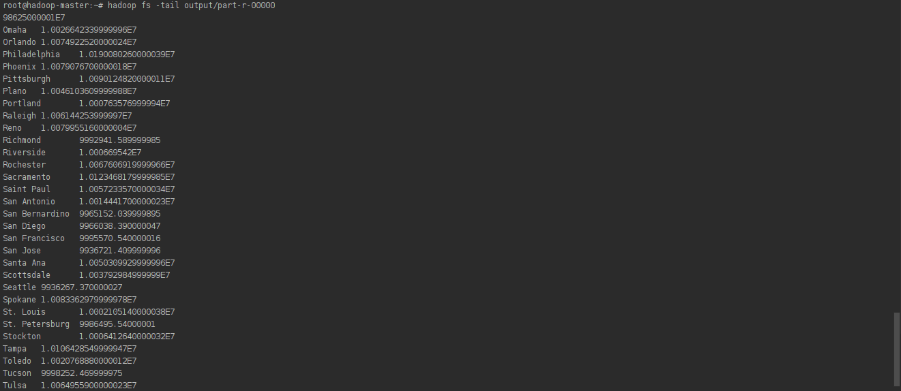

# Big Data Workshop

## Overview

This Repoitoryrepresents the work done in our big data workshop

## In Depth

### TP1

In this first part, we had an introduction to **hadoop**, an open-source software library that is used to manage data processing and storage in big data applications.


for the purpose of testing this solution, we used 3 **docker containers**:

- 1 Master
- 2 Workers

We learnt about hadoop's **HDFS**, in addition to **MapReduce** and **Yarn**

#### Application

**Source code** : [tp1](./resources/tp1)

We created a simple application that calculates the total purchases of a store. our input file contains **tab separated values** having this format

```txt
date   temps   magasin   produit   cout   paiement
```

We used the **Mapper** to get the price value for each row in our file, and then the **Reducer** to sum them all up using `magasin` as our key. hadoop uses the workers under the hood to manage the operations.

##### Result


